# 2. Detailed Design

## 2.1 Profile & Authentication
### 2.1.1 Registration & OTP Onboarding
a) Class Diagram – `AuthController`, `IAuthServices`, `IUserRepositories`, `NotificationServicesImpl`, `User`, `UserOtp`.
b) Sequence Diagram – Client submits `RequestDTORegister` → controller validates → service hashes password, saves user, generates OTP, calls notification channel, waits for `/verify-otp`.

#### Class Diagram
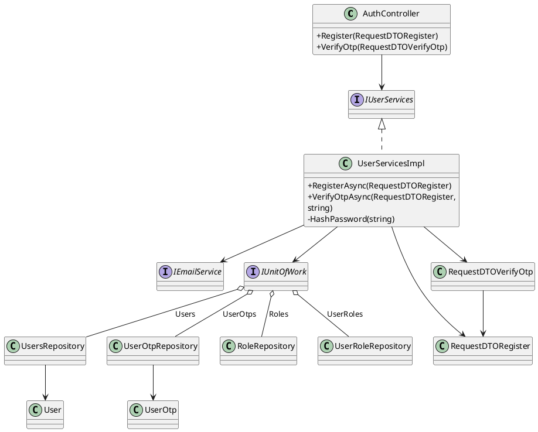
```plantuml
@startuml
skinparam classAttributeIconSize 0
skinparam wrapWidth 220

class AuthController {
  +Register(RequestDTORegister)
  +VerifyOtp(RequestDTOVerifyOtp)
}

interface IUserServices
class UserServicesImpl {
  +RegisterAsync(RequestDTORegister)
  +VerifyOtpAsync(RequestDTORegister, string)
  -HashPassword(string)
}

interface IEmailService
interface IUnitOfWork

class UsersRepository
class UserOtpRepository
class RoleRepository
class UserRoleRepository

class RequestDTORegister
class RequestDTOVerifyOtp
class User
class UserOtp

AuthController --> IUserServices
IUserServices <|.. UserServicesImpl
UserServicesImpl --> IUnitOfWork
UserServicesImpl --> IEmailService

IUnitOfWork o-- UsersRepository : Users
IUnitOfWork o-- UserOtpRepository : UserOtps
IUnitOfWork o-- RoleRepository : Roles
IUnitOfWork o-- UserRoleRepository : UserRoles

UsersRepository --> User
UserOtpRepository --> UserOtp
RequestDTOVerifyOtp --> RequestDTORegister
UserServicesImpl --> RequestDTORegister
UserServicesImpl --> RequestDTOVerifyOtp
@enduml
```

#### Sequence Diagram
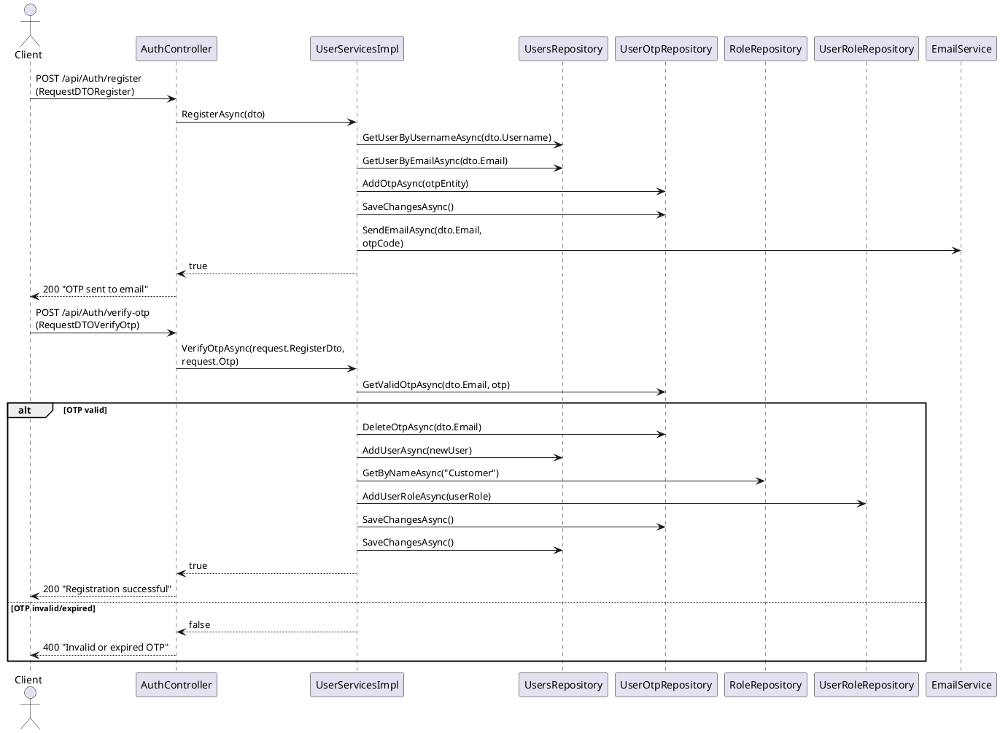
```plantuml
@startuml
skinparam maxMessageSize 220
actor Client
participant "AuthController" as AC
participant "UserServicesImpl" as US
participant "UsersRepository" as UsersRepo
participant "UserOtpRepository" as OtpRepo
participant "RoleRepository" as RoleRepo
participant "UserRoleRepository" as UserRoleRepo
participant "EmailService" as EmailSvc

Client -> AC: POST /api/Auth/register\n(RequestDTORegister)
AC -> US: RegisterAsync(dto)
US -> UsersRepo: GetUserByUsernameAsync(dto.Username)
US -> UsersRepo: GetUserByEmailAsync(dto.Email)
US -> OtpRepo: AddOtpAsync(otpEntity)
US -> OtpRepo: SaveChangesAsync()
US -> EmailSvc: SendEmailAsync(dto.Email, otpCode)
US --> AC: true
AC --> Client: 200 "OTP sent to email"

Client -> AC: POST /api/Auth/verify-otp\n(RequestDTOVerifyOtp)
AC -> US: VerifyOtpAsync(request.RegisterDto, request.Otp)
US -> OtpRepo: GetValidOtpAsync(dto.Email, otp)
alt OTP valid
  US -> OtpRepo: DeleteOtpAsync(dto.Email)
  US -> UsersRepo: AddUserAsync(newUser)
  US -> RoleRepo: GetByNameAsync("Customer")
  US -> UserRoleRepo: AddUserRoleAsync(userRole)
  US -> OtpRepo: SaveChangesAsync()
  US -> UsersRepo: SaveChangesAsync()
  US --> AC: true
  AC --> Client: 200 "Registration successful"
else OTP invalid/expired
  US --> AC: false
  AC --> Client: 400 "Invalid or expired OTP"
end
@enduml
```

### 2.1.2 Login & Token Rotation
a) Class Diagram – `AuthController`, `IAuthServices`, `ITokenProvider`, `IRefreshTokenRepository`, `User`.
b) Sequence Diagram – Client posts credentials → service verifies password → issues JWT/refresh token → persists refresh token → returns tokens → `/refresh` exchanges refresh token for new pair.

#### Class Diagram
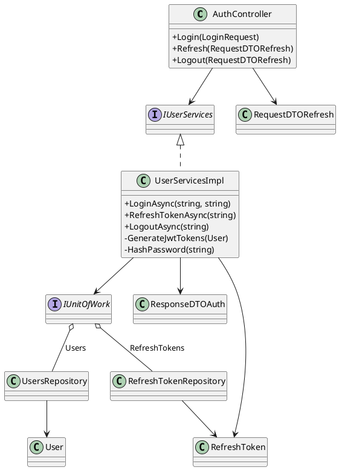
```plantuml
@startuml
skinparam classAttributeIconSize 0
skinparam wrapWidth 220

class AuthController {
  +Login(LoginRequest)
  +Refresh(RequestDTORefresh)
  +Logout(RequestDTORefresh)
}

interface IUserServices
class UserServicesImpl {
  +LoginAsync(string, string)
  +RefreshTokenAsync(string)
  +LogoutAsync(string)
  -GenerateJwtTokens(User)
  -HashPassword(string)
}

interface IUnitOfWork
class UsersRepository
class RefreshTokenRepository
class RequestDTORefresh
class ResponseDTOAuth
class RefreshToken
class User

AuthController --> IUserServices
IUserServices <|.. UserServicesImpl
UserServicesImpl --> IUnitOfWork
IUnitOfWork o-- UsersRepository : Users
IUnitOfWork o-- RefreshTokenRepository : RefreshTokens

UsersRepository --> User
RefreshTokenRepository --> RefreshToken
AuthController --> RequestDTORefresh
UserServicesImpl --> ResponseDTOAuth
UserServicesImpl --> RefreshToken
@enduml
```

#### Sequence Diagram
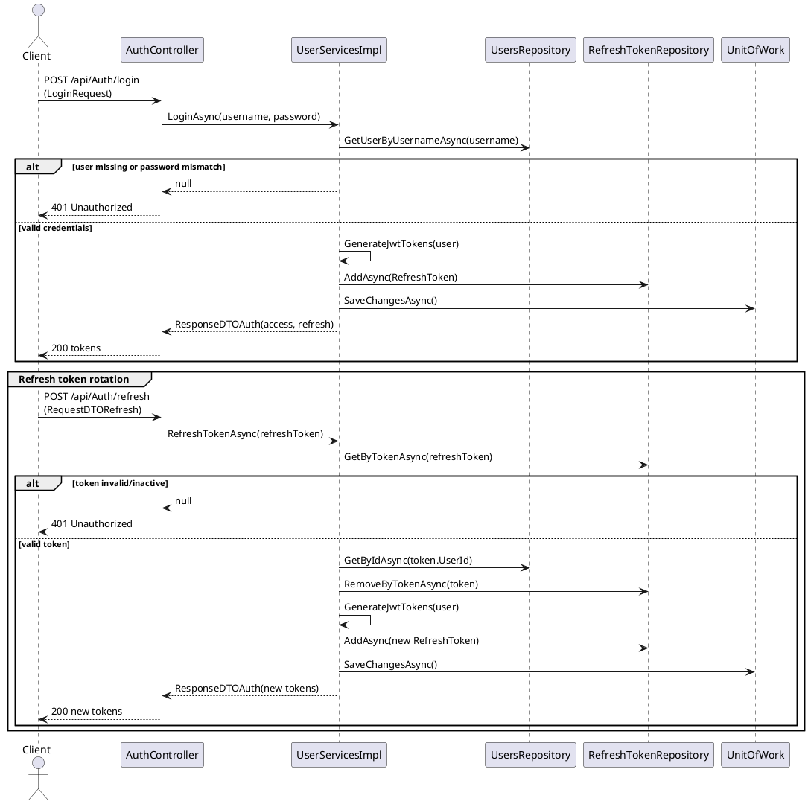
```plantuml
@startuml
skinparam maxMessageSize 220
actor Client
participant "AuthController" as AC
participant "UserServicesImpl" as US
participant "UsersRepository" as UsersRepo
participant "RefreshTokenRepository" as RefreshRepo
participant "UnitOfWork" as UOW

Client -> AC: POST /api/Auth/login\n(LoginRequest)
AC -> US: LoginAsync(username, password)
US -> UsersRepo: GetUserByUsernameAsync(username)
alt user missing or password mismatch
  US --> AC: null
  AC --> Client: 401 Unauthorized
else valid credentials
  US -> US: GenerateJwtTokens(user)
  US -> RefreshRepo: AddAsync(RefreshToken)
  US -> UOW: SaveChangesAsync()
  US --> AC: ResponseDTOAuth(access, refresh)
  AC --> Client: 200 tokens
end

group Refresh token rotation
  Client -> AC: POST /api/Auth/refresh\n(RequestDTORefresh)
  AC -> US: RefreshTokenAsync(refreshToken)
  US -> RefreshRepo: GetByTokenAsync(refreshToken)
  alt token invalid/inactive
    US --> AC: null
    AC --> Client: 401 Unauthorized
  else valid token
    US -> UsersRepo: GetByIdAsync(token.UserId)
    US -> RefreshRepo: RemoveByTokenAsync(token)
    US -> US: GenerateJwtTokens(user)
    US -> RefreshRepo: AddAsync(new RefreshToken)
    US -> UOW: SaveChangesAsync()
    US --> AC: ResponseDTOAuth(new tokens)
    AC --> Client: 200 new tokens
  end
end
@enduml
```

### 2.1.3 Password Recovery & OTP Verification
a) Class Diagram – `AuthController`, `IAuthServices`, `IUserRepositories`, `IEmailService`, `UserOtp`.
b) Sequence Diagram – `/forgot-password` generates OTP → `/verify-otp` validates → `/reset-password` updates hash and clears OTP.

#### Class Diagram
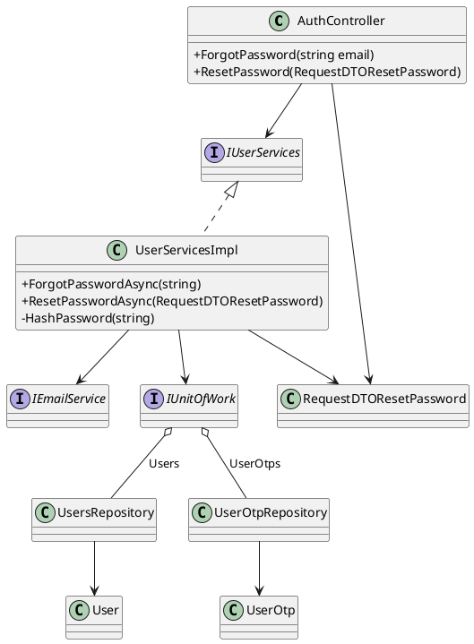
```plantuml
@startuml
skinparam classAttributeIconSize 0
skinparam wrapWidth 220

class AuthController {
  +ForgotPassword(string email)
  +ResetPassword(RequestDTOResetPassword)
}

interface IUserServices
class UserServicesImpl {
  +ForgotPasswordAsync(string)
  +ResetPasswordAsync(RequestDTOResetPassword)
  -HashPassword(string)
}

interface IEmailService
interface IUnitOfWork
class UsersRepository
class UserOtpRepository
class RequestDTOResetPassword
class User
class UserOtp

AuthController --> IUserServices
IUserServices <|.. UserServicesImpl
UserServicesImpl --> IEmailService
UserServicesImpl --> IUnitOfWork

IUnitOfWork o-- UsersRepository : Users
IUnitOfWork o-- UserOtpRepository : UserOtps

UsersRepository --> User
UserOtpRepository --> UserOtp
AuthController --> RequestDTOResetPassword
UserServicesImpl --> RequestDTOResetPassword
@enduml
```

#### Sequence Diagram
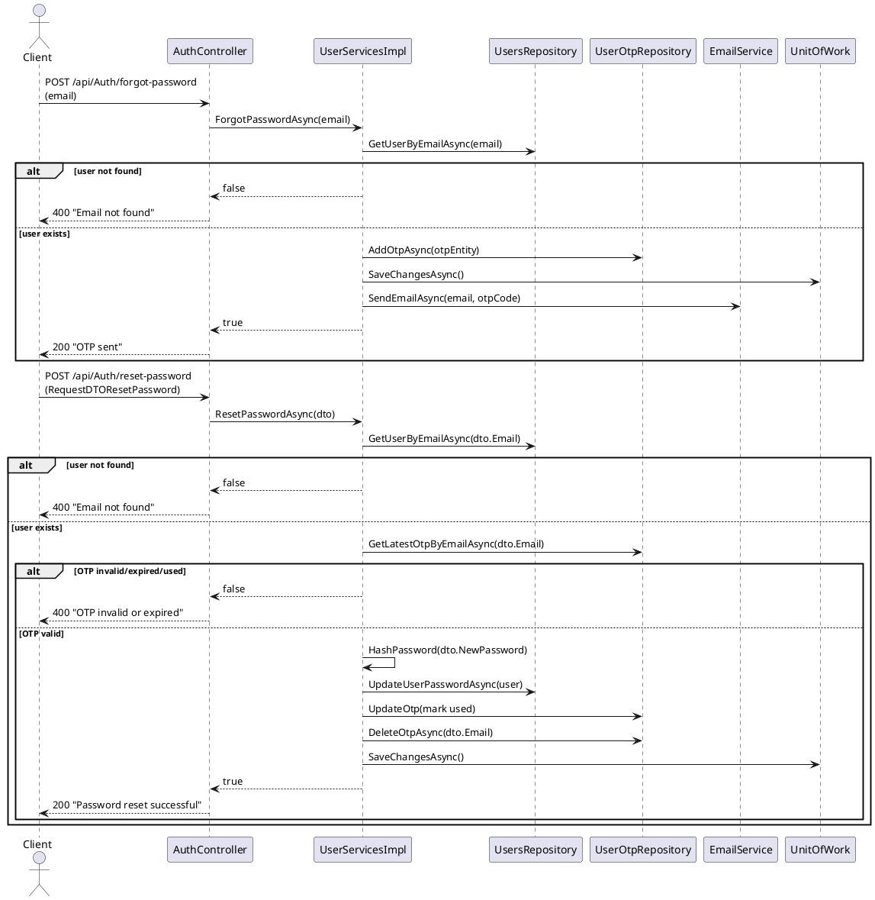
```plantuml
@startuml
skinparam maxMessageSize 220
actor Client
participant "AuthController" as AC
participant "UserServicesImpl" as US
participant "UsersRepository" as UsersRepo
participant "UserOtpRepository" as OtpRepo
participant "EmailService" as EmailSvc
participant "UnitOfWork" as UOW

Client -> AC: POST /api/Auth/forgot-password\n(email)
AC -> US: ForgotPasswordAsync(email)
US -> UsersRepo: GetUserByEmailAsync(email)
alt user not found
  US --> AC: false
  AC --> Client: 400 "Email not found"
else user exists
  US -> OtpRepo: AddOtpAsync(otpEntity)
  US -> UOW: SaveChangesAsync()
  US -> EmailSvc: SendEmailAsync(email, otpCode)
  US --> AC: true
  AC --> Client: 200 "OTP sent"
end

Client -> AC: POST /api/Auth/reset-password\n(RequestDTOResetPassword)
AC -> US: ResetPasswordAsync(dto)
US -> UsersRepo: GetUserByEmailAsync(dto.Email)
alt user not found
  US --> AC: false
  AC --> Client: 400 "Email not found"
else user exists
  US -> OtpRepo: GetLatestOtpByEmailAsync(dto.Email)
  alt OTP invalid/expired/used
    US --> AC: false
    AC --> Client: 400 "OTP invalid or expired"
  else OTP valid
    US -> US: HashPassword(dto.NewPassword)
    US -> UsersRepo: UpdateUserPasswordAsync(user)
    US -> OtpRepo: UpdateOtp(mark used)
    US -> OtpRepo: DeleteOtpAsync(dto.Email)
    US -> UOW: SaveChangesAsync()
    US --> AC: true
    AC --> Client: 200 "Password reset successful"
  end
end
@enduml
```

### 2.1.4 Logout & Token Revocation
a) Class Diagram – `AuthController`, `IRefreshTokenRepository`, `IUserRepositories`.
b) Sequence Diagram – Client sends refresh token → service deletes token row → invalidates session.

#### Class Diagram
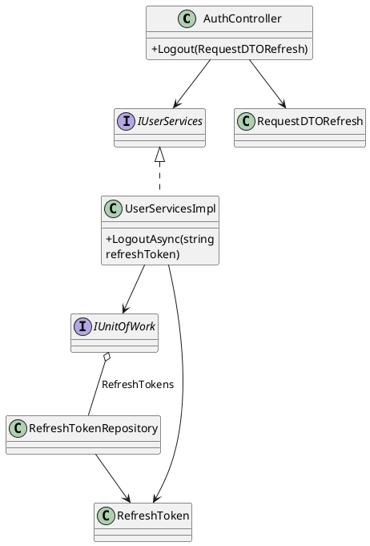
```plantuml
@startuml
skinparam classAttributeIconSize 0
skinparam wrapWidth 220

class AuthController {
  +Logout(RequestDTORefresh)
}

interface IUserServices
class UserServicesImpl {
  +LogoutAsync(string refreshToken)
}

interface IUnitOfWork
class RefreshTokenRepository
class RequestDTORefresh
class RefreshToken

AuthController --> IUserServices
IUserServices <|.. UserServicesImpl
UserServicesImpl --> IUnitOfWork
IUnitOfWork o-- RefreshTokenRepository : RefreshTokens

RefreshTokenRepository --> RefreshToken
AuthController --> RequestDTORefresh
UserServicesImpl --> RefreshToken
@enduml
```

#### Sequence Diagram
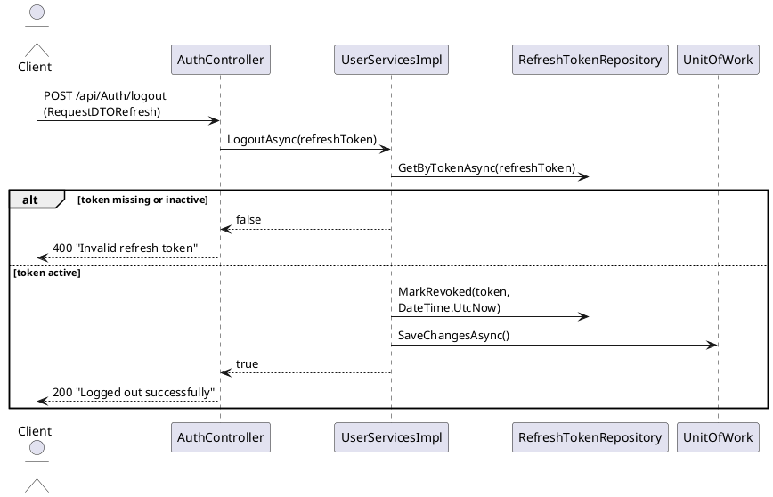
```plantuml
@startuml
skinparam maxMessageSize 220
actor Client
participant "AuthController" as AC
participant "UserServicesImpl" as US
participant "RefreshTokenRepository" as RefreshRepo
participant "UnitOfWork" as UOW

Client -> AC: POST /api/Auth/logout\n(RequestDTORefresh)
AC -> US: LogoutAsync(refreshToken)
US -> RefreshRepo: GetByTokenAsync(refreshToken)
alt token missing or inactive
  US --> AC: false
  AC --> Client: 400 "Invalid refresh token"
else token active
  US -> RefreshRepo: MarkRevoked(token, DateTime.UtcNow)
  US -> UOW: SaveChangesAsync()
  US --> AC: true
  AC --> Client: 200 "Logged out successfully"
end
@enduml
```

## 2.2 User Profile & Address Book
### 2.2.1 Self Profile Management
a) Class Diagram – `UserController`, `IUserServices`, `User`, `ResponseDTOUser`.
b) Sequence Diagram – `/api/User/me` GET/PUT fetches profile, applies validation, persists changes.

#### Class Diagram
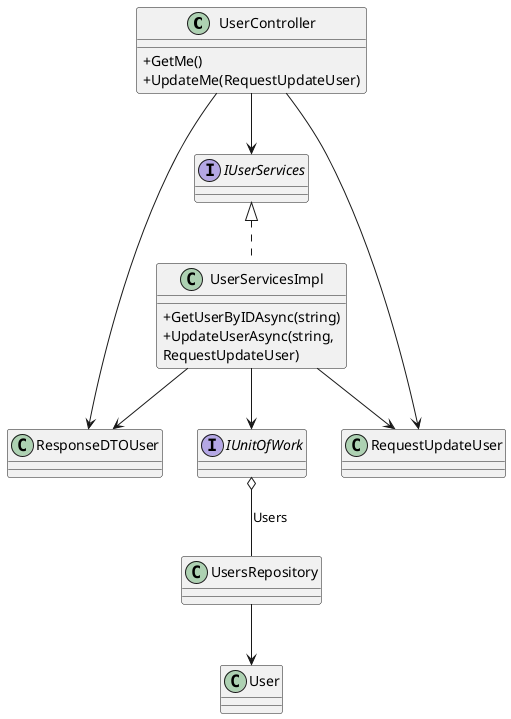
```plantuml
@startuml
skinparam classAttributeIconSize 0
skinparam wrapWidth 220

class UserController {
  +GetMe()
  +UpdateMe(RequestUpdateUser)
}

interface IUserServices
class UserServicesImpl {
  +GetUserByIDAsync(string)
  +UpdateUserAsync(string, RequestUpdateUser)
}

interface IUnitOfWork
class UsersRepository
class RequestUpdateUser
class ResponseDTOUser
class User

UserController --> IUserServices
IUserServices <|.. UserServicesImpl
UserServicesImpl --> IUnitOfWork
IUnitOfWork o-- UsersRepository : Users

UsersRepository --> User
UserController --> ResponseDTOUser
UserController --> RequestUpdateUser
UserServicesImpl --> ResponseDTOUser
UserServicesImpl --> RequestUpdateUser
@enduml
```

#### Sequence Diagram
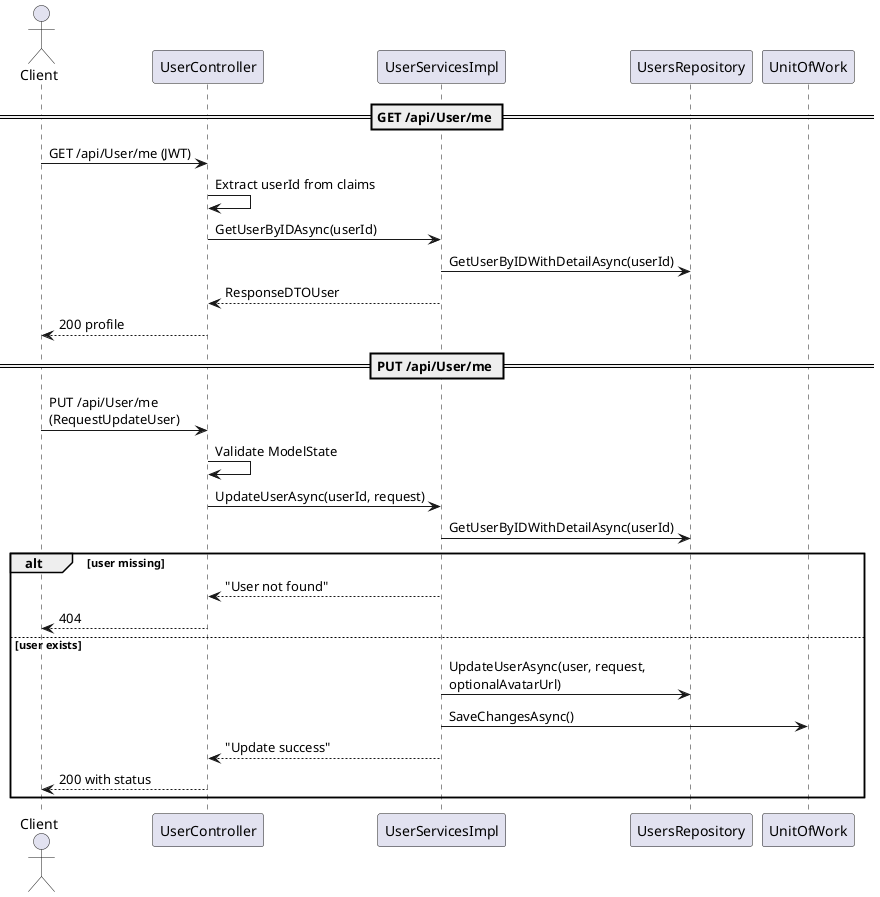
```plantuml
@startuml
skinparam maxMessageSize 220
actor Client
participant "UserController" as UC
participant "UserServicesImpl" as US
participant "UsersRepository" as UsersRepo
participant "UnitOfWork" as UOW

== GET /api/User/me ==
Client -> UC: GET /api/User/me (JWT)
UC -> UC: Extract userId from claims
UC -> US: GetUserByIDAsync(userId)
US -> UsersRepo: GetUserByIDWithDetailAsync(userId)
US --> UC: ResponseDTOUser
UC --> Client: 200 profile

== PUT /api/User/me ==
Client -> UC: PUT /api/User/me\n(RequestUpdateUser)
UC -> UC: Validate ModelState
UC -> US: UpdateUserAsync(userId, request)
US -> UsersRepo: GetUserByIDWithDetailAsync(userId)
alt user missing
  US --> UC: "User not found"
  UC --> Client: 404
else user exists
  US -> UsersRepo: UpdateUserAsync(user, request, optionalAvatarUrl)
  US -> UOW: SaveChangesAsync()
  US --> UC: "Update success"
  UC --> Client: 200 with status
end
@enduml
```

### 2.2.2 Address CRUD & Default Selection
a) Class Diagram – `AddressController` (via `OrderServiceImpl`), `IAddressService`, `Address`, `IUnitOfWork`.
b) Sequence Diagram – Client creates/updates addresses → service enforces GHN metadata and default flags → order checkout references `AddressId`.

#### Class Diagram
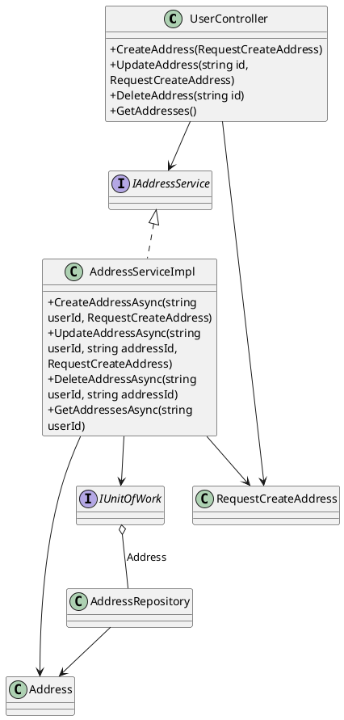
```plantuml
@startuml
skinparam classAttributeIconSize 0
skinparam wrapWidth 220

class UserController {
  +CreateAddress(RequestCreateAddress)
  +UpdateAddress(string id, RequestCreateAddress)
  +DeleteAddress(string id)
  +GetAddresses()
}

interface IAddressService
class AddressServiceImpl {
  +CreateAddressAsync(string userId, RequestCreateAddress)
  +UpdateAddressAsync(string userId, string addressId, RequestCreateAddress)
  +DeleteAddressAsync(string userId, string addressId)
  +GetAddressesAsync(string userId)
}

interface IUnitOfWork
class AddressRepository
class RequestCreateAddress
class Address

UserController --> IAddressService
IAddressService <|.. AddressServiceImpl
AddressServiceImpl --> IUnitOfWork
IUnitOfWork o-- AddressRepository : Address

AddressRepository --> Address
UserController --> RequestCreateAddress
AddressServiceImpl --> RequestCreateAddress
AddressServiceImpl --> Address
@enduml
```

#### Sequence Diagram
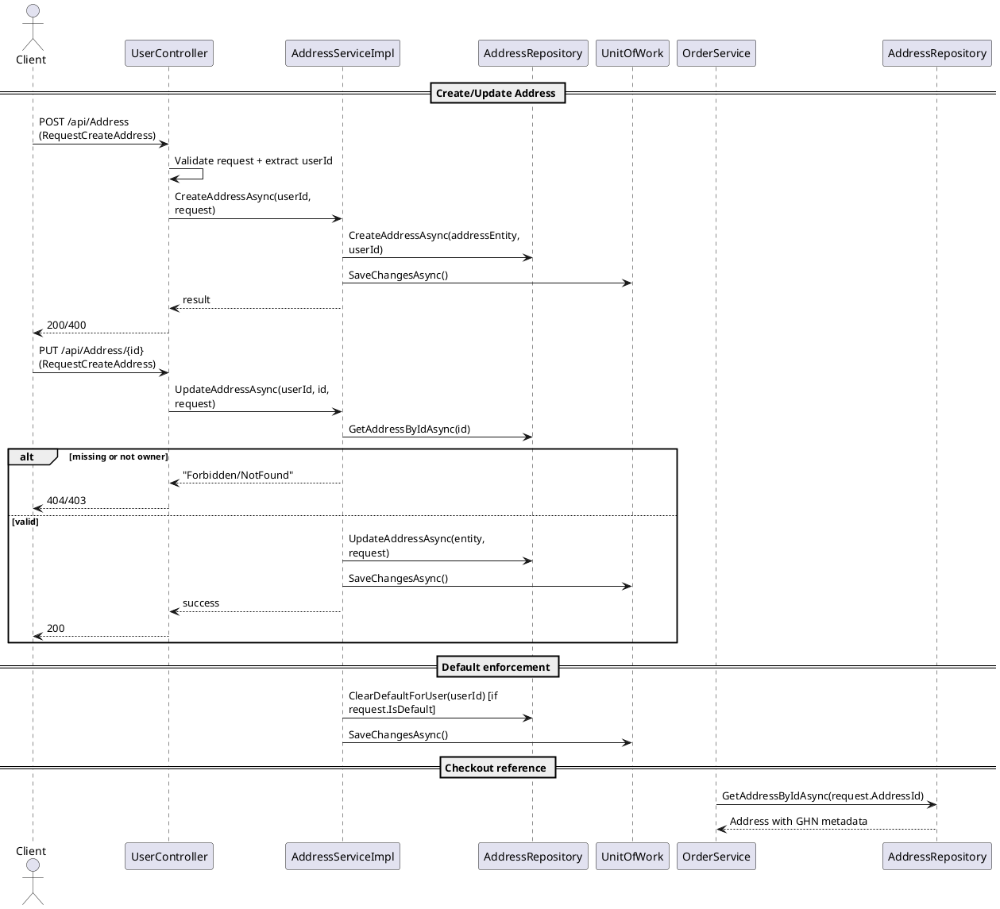
```plantuml
@startuml
skinparam maxMessageSize 220
actor Client
participant "UserController" as UC
participant "AddressServiceImpl" as AS
participant "AddressRepository" as AddrRepo
participant "UnitOfWork" as UOW

== Create/Update Address ==
Client -> UC: POST /api/Address\n(RequestCreateAddress)
UC -> UC: Validate request + extract userId
UC -> AS: CreateAddressAsync(userId, request)
AS -> AddrRepo: CreateAddressAsync(addressEntity, userId)
AS -> UOW: SaveChangesAsync()
AS --> UC: result
UC --> Client: 200/400

Client -> UC: PUT /api/Address/{id}\n(RequestCreateAddress)
UC -> AS: UpdateAddressAsync(userId, id, request)
AS -> AddrRepo: GetAddressByIdAsync(id)
alt missing or not owner
  AS --> UC: "Forbidden/NotFound"
  UC --> Client: 404/403
else valid
  AS -> AddrRepo: UpdateAddressAsync(entity, request)
  AS -> UOW: SaveChangesAsync()
  AS --> UC: success
  UC --> Client: 200
end

== Default enforcement ==
AS -> AddrRepo: ClearDefaultForUser(userId) [if request.IsDefault]
AS -> UOW: SaveChangesAsync()

== Checkout reference ==
OrderService -> AddressRepository: GetAddressByIdAsync(request.AddressId)
OrderService <-- AddressRepository: Address with GHN metadata
@enduml
```

### 2.2.3 GHN Master Data Lookup
a) Class Diagram – `GhnMasterDataController`, `IGhnMasterDataService`.
b) Sequence Diagram – Client queries province/district/ward endpoints → service proxies to GHN API and caches results.

#### Class Diagram
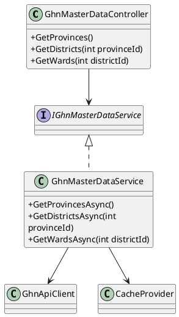
```plantuml
@startuml
skinparam classAttributeIconSize 0
skinparam wrapWidth 220

class GhnMasterDataController {
  +GetProvinces()
  +GetDistricts(int provinceId)
  +GetWards(int districtId)
}

interface IGhnMasterDataService
class GhnMasterDataService {
  +GetProvincesAsync()
  +GetDistrictsAsync(int provinceId)
  +GetWardsAsync(int districtId)
}

class GhnApiClient
class CacheProvider

GhnMasterDataController --> IGhnMasterDataService
IGhnMasterDataService <|.. GhnMasterDataService
GhnMasterDataService --> GhnApiClient
GhnMasterDataService --> CacheProvider
@enduml
```

#### Sequence Diagram
```plantuml
@startuml
skinparam maxMessageSize 220
actor Client
participant "GhnMasterDataController" as MC
participant "GhnMasterDataService" as MS
participant "CacheProvider" as Cache
participant "GHN API" as GHN

Client -> MC: GET /api/ghn/master-data/provinces
MC -> MS: GetProvincesAsync()
MS -> Cache: TryGet("provinces")
alt cache hit
  Cache --> MS: provinces
else cache miss
  MS -> GHN: GET /provinces
  GHN --> MS: provinces payload
  MS -> Cache: Set("provinces", payload, ttl)
end
MS --> MC: provinces
MC --> Client: 200 JSON

== Similar for districts/wards ==
Client -> MC: GET /api/ghn/master-data/districts?provinceId=x
MC -> MS: GetDistrictsAsync(x)
MS -> Cache: TryGet("districts:x")
..
@enduml
```

## 2.3 Catalog & Content Management
### 2.3.1 Product & Inventory CRUD
a) Class Diagram – `ProductController`, `IProductServices`, `IProductRepositories`, `Product`, `ProductShippingProfile`.
b) Sequence Diagram – Admin/artisan requests create/update product, uploads metadata, service saves product and updates search embeddings if needed.

#### Class Diagram
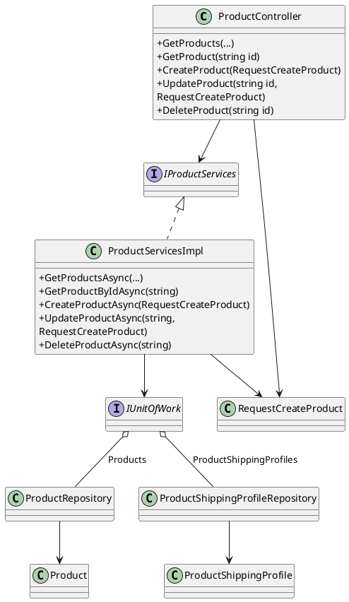
```plantuml
@startuml
skinparam classAttributeIconSize 0
skinparam wrapWidth 220

class ProductController {
  +GetProducts(...)
  +GetProduct(string id)
  +CreateProduct(RequestCreateProduct)
  +UpdateProduct(string id, RequestCreateProduct)
  +DeleteProduct(string id)
}

interface IProductServices
class ProductServicesImpl {
  +GetProductsAsync(...)
  +GetProductByIdAsync(string)
  +CreateProductAsync(RequestCreateProduct)
  +UpdateProductAsync(string, RequestCreateProduct)
  +DeleteProductAsync(string)
}

interface IUnitOfWork
class ProductRepository
class ProductShippingProfileRepository
class RequestCreateProduct
class Product
class ProductShippingProfile

ProductController --> IProductServices
IProductServices <|.. ProductServicesImpl
ProductServicesImpl --> IUnitOfWork
IUnitOfWork o-- ProductRepository : Products
IUnitOfWork o-- ProductShippingProfileRepository : ProductShippingProfiles

ProductRepository --> Product
ProductShippingProfileRepository --> ProductShippingProfile
ProductController --> RequestCreateProduct
ProductServicesImpl --> RequestCreateProduct
@enduml
```

#### Sequence Diagram
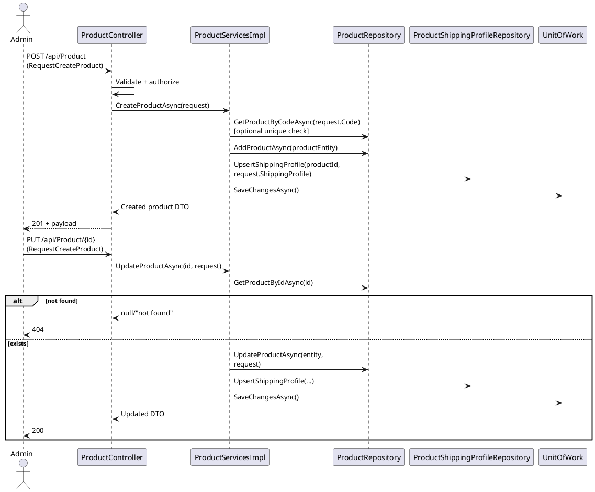
```plantuml
@startuml
skinparam maxMessageSize 220
actor Admin as Admin
participant "ProductController" as PC
participant "ProductServicesImpl" as PS
participant "ProductRepository" as ProdRepo
participant "ProductShippingProfileRepository" as ShipRepo
participant "UnitOfWork" as UOW

Admin -> PC: POST /api/Product\n(RequestCreateProduct)
PC -> PC: Validate + authorize
PC -> PS: CreateProductAsync(request)
PS -> ProdRepo: GetProductByCodeAsync(request.Code) [optional unique check]
PS -> ProdRepo: AddProductAsync(productEntity)
PS -> ShipRepo: UpsertShippingProfile(productId, request.ShippingProfile)
PS -> UOW: SaveChangesAsync()
PS --> PC: Created product DTO
PC --> Admin: 201 + payload

Admin -> PC: PUT /api/Product/{id}\n(RequestCreateProduct)
PC -> PS: UpdateProductAsync(id, request)
PS -> ProdRepo: GetProductByIdAsync(id)
alt not found
  PS --> PC: null/"not found"
  PC --> Admin: 404
else exists
  PS -> ProdRepo: UpdateProductAsync(entity, request)
  PS -> ShipRepo: UpsertShippingProfile(...)
  PS -> UOW: SaveChangesAsync()
  PS --> PC: Updated DTO
  PC --> Admin: 200
end
@enduml
```

### 2.3.2 Product Media Management
a) Class Diagram – `ProductImagesController`, `IProductImagesServices`, `CloudinaryProvider`.
b) Sequence Diagram – Client uploads image → service streams to storage → persists `ProductImage` rows with ordering.

#### Class Diagram
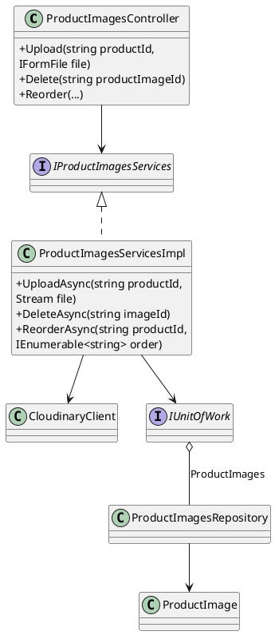
```plantuml
@startuml
skinparam classAttributeIconSize 0
skinparam wrapWidth 220

class ProductImagesController {
  +Upload(string productId, IFormFile file)
  +Delete(string productImageId)
  +Reorder(...)
}

interface IProductImagesServices
class ProductImagesServicesImpl {
  +UploadAsync(string productId, Stream file)
  +DeleteAsync(string imageId)
  +ReorderAsync(string productId, IEnumerable<string> order)
}

class CloudinaryClient
interface IUnitOfWork
class ProductImagesRepository
class ProductImage

ProductImagesController --> IProductImagesServices
IProductImagesServices <|.. ProductImagesServicesImpl
ProductImagesServicesImpl --> CloudinaryClient
ProductImagesServicesImpl --> IUnitOfWork
IUnitOfWork o-- ProductImagesRepository : ProductImages
ProductImagesRepository --> ProductImage
@enduml
```

#### Sequence Diagram
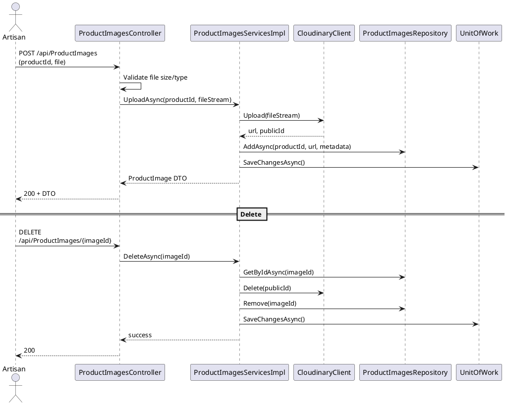
```plantuml
@startuml
skinparam maxMessageSize 220
actor Artisan as Artisan
participant "ProductImagesController" as PIC
participant "ProductImagesServicesImpl" as PIS
participant "CloudinaryClient" as Cloud
participant "ProductImagesRepository" as ImgRepo
participant "UnitOfWork" as UOW

Artisan -> PIC: POST /api/ProductImages\n(productId, file)
PIC -> PIC: Validate file size/type
PIC -> PIS: UploadAsync(productId, fileStream)
PIS -> Cloud: Upload(fileStream)
Cloud --> PIS: url, publicId
PIS -> ImgRepo: AddAsync(productId, url, metadata)
PIS -> UOW: SaveChangesAsync()
PIS --> PIC: ProductImage DTO
PIC --> Artisan: 200 + DTO

== Delete ==
Artisan -> PIC: DELETE /api/ProductImages/{imageId}
PIC -> PIS: DeleteAsync(imageId)
PIS -> ImgRepo: GetByIdAsync(imageId)
PIS -> Cloud: Delete(publicId)
PIS -> ImgRepo: Remove(imageId)
PIS -> UOW: SaveChangesAsync()
PIS --> PIC: success
PIC --> Artisan: 200
@enduml
```

### 2.3.3 Category & Collection Composition
a) Class Diagram – `CategoryController`, `ProductCollectionController`, respective services and repositories.
b) Sequence Diagram – Admin defines taxonomy, frontend queries `/api/Category`, `/api/ProductCollection`.

#### Class Diagram
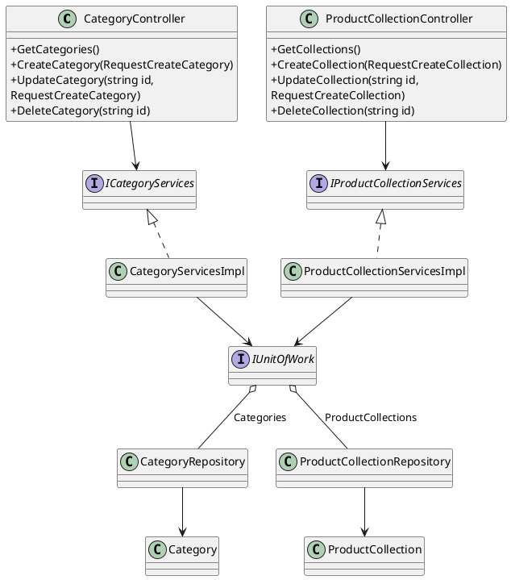
```plantuml
@startuml
skinparam classAttributeIconSize 0
skinparam wrapWidth 220

class CategoryController {
  +GetCategories()
  +CreateCategory(RequestCreateCategory)
  +UpdateCategory(string id, RequestCreateCategory)
  +DeleteCategory(string id)
}

class ProductCollectionController {
  +GetCollections()
  +CreateCollection(RequestCreateCollection)
  +UpdateCollection(string id, RequestCreateCollection)
  +DeleteCollection(string id)
}

interface ICategoryServices
interface IProductCollectionServices

class CategoryServicesImpl
class ProductCollectionServicesImpl

interface IUnitOfWork
class CategoryRepository
class ProductCollectionRepository
class Category
class ProductCollection

CategoryController --> ICategoryServices
ICategoryServices <|.. CategoryServicesImpl
ProductCollectionController --> IProductCollectionServices
IProductCollectionServices <|.. ProductCollectionServicesImpl

CategoryServicesImpl --> IUnitOfWork
ProductCollectionServicesImpl --> IUnitOfWork

IUnitOfWork o-- CategoryRepository : Categories
IUnitOfWork o-- ProductCollectionRepository : ProductCollections

CategoryRepository --> Category
ProductCollectionRepository --> ProductCollection
@enduml
```

#### Sequence Diagram
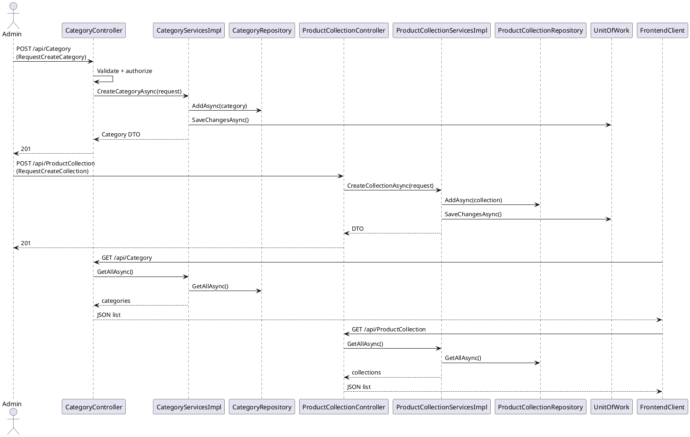
```plantuml
@startuml
skinparam maxMessageSize 220
actor Admin
participant "CategoryController" as CC
participant "CategoryServicesImpl" as CS
participant "CategoryRepository" as CatRepo
participant "ProductCollectionController" as PCC
participant "ProductCollectionServicesImpl" as PCS
participant "ProductCollectionRepository" as ColRepo
participant "UnitOfWork" as UOW

Admin -> CC: POST /api/Category\n(RequestCreateCategory)
CC -> CC: Validate + authorize
CC -> CS: CreateCategoryAsync(request)
CS -> CatRepo: AddAsync(category)
CS -> UOW: SaveChangesAsync()
CS --> CC: Category DTO
CC --> Admin: 201

Admin -> PCC: POST /api/ProductCollection\n(RequestCreateCollection)
PCC -> PCS: CreateCollectionAsync(request)
PCS -> ColRepo: AddAsync(collection)
PCS -> UOW: SaveChangesAsync()
PCS --> PCC: DTO
PCC --> Admin: 201

FrontendClient -> CC: GET /api/Category
CC -> CS: GetAllAsync()
CS -> CatRepo: GetAllAsync()
CS --> CC: categories
CC --> FrontendClient: JSON list

FrontendClient -> PCC: GET /api/ProductCollection
PCC -> PCS: GetAllAsync()
PCS -> ColRepo: GetAllAsync()
PCS --> PCC: collections
PCC --> FrontendClient: JSON list
@enduml
```

### 2.3.4 Blog & Storytelling Content
a) Class Diagram – `BlogController`, `StoryTellingController`, `IBlogPostService`, `IStoryTellingService`.
b) Sequence Diagram – CMS UI posts blog/story data → service persists and exposes read endpoints for storefront.

#### Class Diagram
```plantuml
@startuml
skinparam classAttributeIconSize 0
skinparam wrapWidth 220

class BlogController {
  +GetBlogs(...)
  +CreateBlog(RequestCreateBlog)
  +UpdateBlog(string id, RequestCreateBlog)
  +DeleteBlog(string id)
}

class StoryTellingController {
  +GetStories(...)
  +CreateStory(RequestCreateStory)
  +UpdateStory(string id, RequestCreateStory)
  +DeleteStory(string id)
}

interface IBlogPostService
interface IStoryTellingService

class BlogPostServiceImpl
class StoryTellingServiceImpl

interface IUnitOfWork
class BlogRepository
class StoryTellingRepository
class Blog
class StoryTelling

BlogController --> IBlogPostService
IBlogPostService <|.. BlogPostServiceImpl
StoryTellingController --> IStoryTellingService
IStoryTellingService <|.. StoryTellingServiceImpl

BlogPostServiceImpl --> IUnitOfWork
StoryTellingServiceImpl --> IUnitOfWork

IUnitOfWork o-- BlogRepository : Blogs
IUnitOfWork o-- StoryTellingRepository : Stories

BlogRepository --> Blog
StoryTellingRepository --> StoryTelling
@enduml
```

#### Sequence Diagram
```plantuml
@startuml
skinparam maxMessageSize 220
actor CMSUser as CMS
participant "BlogController" as BC
participant "BlogPostServiceImpl" as BS
participant "BlogRepository" as BlogRepo
participant "StoryTellingController" as SC
participant "StoryTellingServiceImpl" as SS
participant "StoryTellingRepository" as StoryRepo
participant "UnitOfWork" as UOW

== Blog CRUD ==
CMS -> BC: POST /api/Blog\n(RequestCreateBlog)
BC -> BC: Validate + authorize
BC -> BS: CreateBlogAsync(request)
BS -> BlogRepo: AddAsync(blog)
BS -> UOW: SaveChangesAsync()
BS --> BC: Blog DTO
BC --> CMS: 201

CMS -> BC: PUT /api/Blog/{id}\n(RequestCreateBlog)
BC -> BS: UpdateBlogAsync(id, request)
BS -> BlogRepo: GetByIdAsync(id)
... (update + SaveChanges)

== Storytelling CRUD ==
CMS -> SC: POST /api/StoryTelling\n(RequestCreateStory)
SC -> SS: CreateStoryAsync(request)
SS -> StoryRepo: AddAsync(story)
SS -> UOW: SaveChangesAsync()
SS --> SC: Story DTO
SC --> CMS: 201

== Public consumption ==
Frontend -> BC: GET /api/Blog
BC -> BS: GetAllAsync()
BS -> BlogRepo: GetAllAsync()
BS --> BC: blogs
BC --> Frontend: JSON list

Frontend -> SC: GET /api/StoryTelling
SC -> SS: GetAllAsync()
SS -> StoryRepo: GetAllAsync()
SS --> SC: stories
SC --> Frontend: JSON list
@enduml
```

## 2.4 Shopping Cart & Wishlist
### 2.4.1 Cart Lifecycle & Pricing
a) Class Diagram – `CartController`, `ICartService`, `Cart`, `CartItem`, `IProductRepositories`.
b) Sequence Diagram – Client adds/updates items → service recalculates totals, persists per-user cart, reused by checkout.

#### Class Diagram
```plantuml
@startuml
skinparam classAttributeIconSize 0
skinparam wrapWidth 220

class CartController {
  +GetCart()
  +AddItem(RequestCartItem)
  +UpdateItem(string cartItemId, RequestCartItem)
  +RemoveItem(string cartItemId)
  +ClearCart()
}

interface ICartService
class CartServiceImpl {
  +GetCartByUserIdAsync(string)
  +AddItemAsync(string, RequestCartItem)
  +UpdateItemAsync(string, string, RequestCartItem)
  +RemoveItemAsync(string, string)
  +ClearCartAsync(string)
}

interface IUnitOfWork
class CartRepository
class CartItemRepository
class ProductRepository
class Cart
class CartItem
class RequestCartItem

CartController --> ICartService
ICartService <|.. CartServiceImpl
CartServiceImpl --> IUnitOfWork
IUnitOfWork o-- CartRepository : Cart
IUnitOfWork o-- CartItemRepository : CartItem
IUnitOfWork o-- ProductRepository : Product

CartRepository --> Cart
CartItemRepository --> CartItem
ProductRepository --> Product
CartController --> RequestCartItem
CartServiceImpl --> RequestCartItem
@enduml
```

#### Sequence Diagram
```plantuml
@startuml
skinparam maxMessageSize 220
actor Client
participant "CartController" as CC
participant "CartServiceImpl" as CS
participant "CartRepository" as CartRepo
participant "CartItemRepository" as ItemRepo
participant "ProductRepository" as ProdRepo
participant "UnitOfWork" as UOW

== Load Cart ==
Client -> CC: GET /api/Cart
CC -> CC: Extract userId
CC -> CS: GetCartByUserIdAsync(userId)
CS -> CartRepo: GetCartByUserIdAsync(userId)
CS -> ItemRepo: GetAllCartItemByCartIdAsync(cartId)
CS -> ProdRepo: GetProductsByIdsAsync(productIds)
CS --> CC: Cart DTO with totals
CC --> Client: 200 data

== Add Item ==
Client -> CC: POST /api/Cart/items\n(RequestCartItem)
CC -> CS: AddItemAsync(userId, request)
CS -> ProdRepo: GetByIdAsync(request.ProductId)
alt product missing/out of stock
  CS --> CC: error
  CC --> Client: 400
else
  CS -> CartRepo: GetOrCreateCartAsync(userId)
  CS -> ItemRepo: AddOrUpdateAsync(cartId, productId, quantity, price)
  CS -> UOW: SaveChangesAsync()
  CS --> CC: Updated cart
  CC --> Client: 200
end

== Update/Remove ==
Client -> CC: PUT/DELETE /api/Cart/items/{id}
... similar pattern with validations and SaveChanges
@enduml
```

### 2.4.2 Wishlist Tracking
a) Class Diagram – `WishListController`, `IWishListItemService`, `WishListItem`.
b) Sequence Diagram – User toggles wishlist state → service upserts row → `/api/WishList` lists saved products.

#### Class Diagram
```plantuml
@startuml
skinparam classAttributeIconSize 0
skinparam wrapWidth 220

class WishListController {
  +GetWishList()
  +Toggle(string productId)
  +Remove(string productId)
}

interface IWishListItemService
class WishListItemServiceImpl {
  +GetWishListAsync(string userId)
  +ToggleAsync(string userId, string productId)
  +RemoveAsync(string userId, string productId)
}

interface IUnitOfWork
class WishListItemRepository
class ProductRepository
class WishListItem

WishListController --> IWishListItemService
IWishListItemService <|.. WishListItemServiceImpl
WishListItemServiceImpl --> IUnitOfWork
IUnitOfWork o-- WishListItemRepository : WishListItems
IUnitOfWork o-- ProductRepository : Products

WishListItemRepository --> WishListItem
@enduml
```

#### Sequence Diagram
```plantuml
@startuml
skinparam maxMessageSize 220
actor Client
participant "WishListController" as WC
participant "WishListItemServiceImpl" as WS
participant "WishListItemRepository" as WLRepo
participant "ProductRepository" as ProdRepo
participant "UnitOfWork" as UOW

== Toggle ==
Client -> WC: POST /api/WishList/toggle\n(productId)
WC -> WC: Validate and get userId
WC -> WS: ToggleAsync(userId, productId)
WS -> ProdRepo: GetByIdAsync(productId)
alt product missing
  WS --> WC: false
  WC --> Client: 404
else
  WS -> WLRepo: GetByUserAndProductAsync(userId, productId)
  alt exists
    WS -> WLRepo: Remove(entity)
  else not exists
    WS -> WLRepo: AddAsync(new WishListItem)
  end
  WS -> UOW: SaveChangesAsync()
  WS --> WC: success
  WC --> Client: 200
end

== List ==
Client -> WC: GET /api/WishList
WC -> WS: GetWishListAsync(userId)
WS -> WLRepo: GetByUserAsync(userId)
WS -> ProdRepo: GetProductsByIdsAsync(...)
WS --> WC: list DTO
WC --> Client: 200
@enduml
```

## 2.5 Order Processing & Fulfillment
### 2.5.1 Checkout & Voucher Application
a) Class Diagram – `OrderController`, `OrderServiceImpl`, `IVoucherService`, `IUnitOfWork`, `Order`, `OrderItem`.
b) Sequence Diagram – Client posts `RequestCreateOrder` → service resolves cart items, calculates shipping fee, applies voucher, saves order, reserves stock.

#### Class Diagram
```plantuml
@startuml
skinparam classAttributeIconSize 0
skinparam wrapWidth 220

class OrderController {
  +CreateOrder(RequestCreateOrder)
  +GetMyOrders(RequestFilterOrder)
}

interface IOrderService
class OrderServiceImpl {
  +CreateOrderAsync(string userId, RequestCreateOrder)
  +GetAllOrderByUserIdAsync(string userId, RequestFilterOrder)
  -ResolveOrderItemsAsync(...)
  -CalculateShippingFeeAsync(...)
  -ApplyVoucherAsync(...)
}

interface IVoucherService
interface IGhnShippingService
interface IUnitOfWork

class OrderRepository
class OrderDetailRepository
class CartRepository
class CartItemRepository
class ProductRepository
class AddressRepository

class Order
class OrderItem
class RequestCreateOrder
class RequestFilterOrder

OrderController --> IOrderService
IOrderService <|.. OrderServiceImpl
OrderServiceImpl --> IUnitOfWork
OrderServiceImpl --> IVoucherService
OrderServiceImpl --> IGhnShippingService

IUnitOfWork o-- OrderRepository : Orders
IUnitOfWork o-- OrderDetailRepository : OrderItems
IUnitOfWork o-- CartRepository : Carts
IUnitOfWork o-- CartItemRepository : CartItems
IUnitOfWork o-- ProductRepository : Products
IUnitOfWork o-- AddressRepository : Addresses

OrderRepository --> Order
OrderDetailRepository --> OrderItem
OrderController --> RequestCreateOrder
OrderController --> RequestFilterOrder
@enduml
```

#### Sequence Diagram
```plantuml
@startuml
skinparam maxMessageSize 220
actor Client
participant "OrderController" as OC
participant "OrderServiceImpl" as OS
participant "CartRepository" as CartRepo
participant "CartItemRepository" as ItemRepo
participant "ProductRepository" as ProdRepo
participant "AddressRepository" as AddrRepo
participant "IGhnShippingService" as GHN
participant "IVoucherService" as VS
participant "OrderRepository" as OrderRepo
participant "OrderDetailRepository" as OrderItemRepo
participant "UnitOfWork" as UOW

Client -> OC: POST /api/Order/orders\n(RequestCreateOrder)
OC -> OC: Validate + get userId
OC -> OS: CreateOrderAsync(userId, request)
OS -> AddrRepo: GetAddressByIdAsync(request.AddressId)
OS -> OS: ResolveOrderItemsAsync(userId, request)
  OS -> CartRepo/ItemRepo/ProdRepo: fetch cart + products
OS -> GHN: CalculateShippingFeeAsync(requestModel)
OS -> VS: ApplyVoucherAsync(userId, voucherCode, subtotal)
OS -> OS: Compute totals + inventory check
OS -> OrderRepo: CreateOrderAsync(order)
OS -> OrderItemRepo: CreateOrderItemAsync(orderItems)
OS -> UOW: SaveChangesAsync()
OS -> OS: ReserveOrderStockAsync(order)
OS --> OC: CreateOrderResult
OC --> Client: 200 (or 400 on validation failure)
@enduml
```

### 2.5.2 Shipment Orchestration (GHN, Multi-Seller)
a) Class Diagram – `OrderServiceImpl`, `IGhnShippingService`, `SellerShippingProfile`, `Shipment`, `ShipmentHistory`.
b) Sequence Diagram – After COD or paid VNPay, service groups items by seller, builds GHN payload, creates shipments, logs history, clears cart.

#### Class Diagram
```plantuml
@startuml
skinparam classAttributeIconSize 0
skinparam wrapWidth 220

class OrderServiceImpl {
  +CreateShipmentsAfterPaymentAsync(string orderId)
  -TryCreateGhnShipmentsAsync(...)
  -BuildSellerShipmentOptions(...)
}

interface IGhnShippingService
class GhnShippingService
interface IShipmentRealtimeService
interface IVoucherService
interface IUnitOfWork

class ShipmentRepository
class ShipmentHistoryRepository
class SellerShippingProfileRepository
class ProductRepository
class UsersRepository
class AddressRepository

class Order
class OrderItem
class Shipment
class ShipmentHistory
class SellerShippingProfile

OrderServiceImpl --> IGhnShippingService
OrderServiceImpl --> IShipmentRealtimeService
OrderServiceImpl --> IUnitOfWork
OrderServiceImpl --> SellerShippingProfileRepository
OrderServiceImpl --> ProductRepository
OrderServiceImpl --> UsersRepository
OrderServiceImpl --> AddressRepository

IUnitOfWork o-- ShipmentRepository : Shipments
IUnitOfWork o-- ShipmentHistoryRepository : ShipmentHistory

ShipmentRepository --> Shipment
ShipmentHistoryRepository --> ShipmentHistory
SellerShippingProfileRepository --> SellerShippingProfile
@enduml
```

#### Sequence Diagram
```plantuml
@startuml
skinparam maxMessageSize 220
participant "PaymentService / OrderServiceImpl" as Trigger
participant "OrderServiceImpl" as OS
participant "SellerShippingProfileRepository" as SellerRepo
participant "ProductRepository" as ProdRepo
participant "ShipmentRepository" as ShipRepo
participant "ShipmentHistoryRepository" as HistRepo
participant "IGhnShippingService" as GHN
participant "IShipmentRealtimeService" as SRS
participant "UnitOfWork" as UOW

Trigger -> OS: CreateShipmentsAfterPaymentAsync(orderId)
OS -> UOW: OrderRepository.GetAllOrderByIdAsync(orderId)
OS -> ShipRepo: GetByOrderIdAsync(orderId)
alt shipments already exist
  OS -> OrderRepository: UpdateStatus("Shipping")
  OS --> Trigger: true
else no shipments
  OS -> AddressRepository: GetAddressByIdAsync(order.ShipingAddressId)
  OS -> UsersRepository: GetByIdAsync(order.CustomerId)
  OS -> OrderDetailRepository: GetAllOrderItemAsync(order.Id)
  OS -> ProdRepo: GetProductsByIdsAsync(orderItem.ProductID)
  OS -> SellerRepo: GetBySellerIdAsync(...)
  OS -> OS: Group items per seller and build options
  loop each seller group
    OS -> GHN: CreateShippingOrderAsync(order, sellerItems,...)
    alt success with OrderCode
      OS -> ShipRepo: AddAsync(new Shipment)
      OS -> HistRepo: AddAsync("created")
    else failure
      OS -> OS: log warning
    end
  end
  OS -> UOW: SaveChangesAsync()
  OS -> SRS: BroadcastAsync(customerId, shipment, note)
  OS --> Trigger: true/false
end
@enduml
```

### 2.5.3 Order Tracking & Cancellation
a) Class Diagram – `OrderController`, `OrderServiceImpl`, `IShipmentRepositories`, `INotificationService`.
b) Sequence Diagram – `/orders/{id}` fetches details; `/orders/{orderNumber}/cancel` validates status, cancels GHN order, restores stock, emits notifications.

#### Class Diagram
```plantuml
@startuml
skinparam classAttributeIconSize 0
skinparam wrapWidth 220

class OrderController {
  +GetOrderById(string orderId)
  +CancelOrder(string orderNumber, RequestCancelOrder)
  +GetOrdersPaged(...)
}

class OrderServiceImpl {
  +GetOrderByIdAsync(string orderId)
  +CancelOrderAsync(string userId, string orderNumber, RequestCancelOrder)
  -RestoreOrderStockAsync(Order)
}

interface IShipmentRepositories
interface INotificationService
interface IGhnShippingService
interface IUnitOfWork

class ShipmentRepository
class ShipmentHistoryRepository
class OrderRepository
class ProductRepository

class RequestCancelOrder
class ResponseDTOOrder

OrderController --> OrderServiceImpl
OrderServiceImpl --> IUnitOfWork
OrderServiceImpl --> IGhnShippingService
OrderServiceImpl --> INotificationService

IUnitOfWork o-- ShipmentRepository : Shipments
IUnitOfWork o-- ShipmentHistoryRepository : ShipmentHistory
IUnitOfWork o-- OrderRepository : Orders
IUnitOfWork o-- ProductRepository : Products
@enduml
```

#### Sequence Diagram
```plantuml
@startuml
skinparam maxMessageSize 220
actor Client
participant "OrderController" as OC
participant "OrderServiceImpl" as OS
participant "OrderRepository" as OrderRepo
participant "ShipmentRepository" as ShipRepo
participant "IGhnShippingService" as GHN
participant "INotificationService" as NotiSvc
participant "UnitOfWork" as UOW

== Tracking ==
Client -> OC: GET /api/Order/orders/{orderId}
OC -> OS: GetOrderByIdAsync(orderId)
OS -> OrderRepo: GetAllOrderByNumberAsync(orderId)
OS --> OC: ResponseDTOOrder
OC --> Client: 200 / 404

== Cancellation ==
Client -> OC: POST /api/Order/orders/{orderNumber}/cancel\n(RequestCancelOrder)
OC -> OC: Check userId + ModelState
OC -> OS: CancelOrderAsync(userId, orderNumber, request)
OS -> OrderRepo: GetByOrderNumberForUserAsync(userId, orderNumber)
alt order not found or status invalid
  OS --> OC: "Cannot cancel"
  OC --> Client: 400/404
else cancellable
  OS -> ShipRepo: GetByOrderIdAsync(order.Id)
  loop each shipment
    OS -> GHN: CancelShippingOrderAsync(shipment.TrackingNumber)
    OS -> ShipmentHistoryRepository: AddAsync("cancelled")
  end
  OS -> OS: RestoreOrderStockAsync(order)
  OS -> OrderRepo: UpdateStatus("Cancelled")
  OS -> UOW: SaveChangesAsync()
  OS -> NotiSvc: NotifyOrderCreatedAsync/NotifyPaymentStatusAsync (if refund voucher etc.)
  OS --> OC: "Cancel order successfully!"
  OC --> Client: 200
end
@enduml
```

## 2.6 Payments & COD Handling
### 2.6.1 VNPay Payment Initialization
a) Class Diagram – `OrderController`, `PaymentController`, `PaymentServiceImpl`, `Payment`, `VnpaySettings`.
b) Sequence Diagram – Controller requests VNPay payment → service reserves inventory, creates `Payment` row, generates signed URL/QR for redirect.

#### Class Diagram
```plantuml
@startuml
skinparam classAttributeIconSize 0
skinparam wrapWidth 220

class OrderController {
  +CreateOrder(RequestCreateOrder)
  +ContinueVnpayPayment(string orderNumber)
}

class PaymentController {
  +CreateVnpayPayment(CreateVnpayPaymentRequest)
}

interface IPaymentService
class PaymentServiceImpl {
  +CreateVnpayPaymentAsync(string userId, CreateVnpayPaymentRequest, string clientIp)
  +UpdatePaymentStatusAsync(UpdatePaymentStatusRequest)
  -ReserveOrderStockAsync(Order)
  -BuildPaymentUrl(...)
}

interface IOrderService
class OrderServiceImpl
interface INotificationService
interface IUnitOfWork

class OrderRepository
class PaymentRepository
class CartRepository
class CartItemRepository

class Order
class Payment
class CreateVnpayPaymentRequest
class ResponseDTOAuth

OrderController --> IOrderService
OrderController --> IPaymentService
PaymentController --> IPaymentService
IPaymentService <|.. PaymentServiceImpl
PaymentServiceImpl --> IUnitOfWork
PaymentServiceImpl --> INotificationService
PaymentServiceImpl --> IOrderService

IUnitOfWork o-- OrderRepository : Orders
IUnitOfWork o-- PaymentRepository : Payments
IUnitOfWork o-- CartRepository : Carts
IUnitOfWork o-- CartItemRepository : CartItems

OrderRepository --> Order
PaymentRepository --> Payment
@enduml
```

#### Sequence Diagram
```plantuml
@startuml
skinparam maxMessageSize 220
actor Client
participant "OrderController" as OC
participant "OrderServiceImpl" as OS
participant "PaymentServiceImpl" as PS
participant "PaymentController" as PC
participant "PaymentRepository" as PayRepo
participant "OrderRepository" as OrderRepo
participant "UnitOfWork" as UOW
participant "VNPay Gateway" as VNPAY

Client -> OC: POST /api/Order/orders\n(paymentMethod=VNPAY)
OC -> OS: CreateOrderAsync(userId, request)
OS -> ...: (resolve items, save order)
OS --> OC: CreateOrderResult (Pending, orderId)
OC -> PS: CreateVnpayPaymentAsync(userId, { OrderId }, clientIp)
PS -> OrderRepo: GetAllOrderByIdAsync(orderId)
PS -> PS: ReserveOrderStockAsync(order)
PS -> PayRepo: CancelPendingVnpayPayments(order.Id)
PS -> PS: BuildPaymentUrl(orderNumber, amount, bankCode, clientIp)
PS -> PayRepo: AddAsync(new Payment { Pending, Method=VNPAY })
PS -> UOW: SaveChangesAsync()
PS --> OC: VnpayPaymentResponse (paymentUrl, paymentId)
OC --> Client: 200 + paymentUrl
Client -> VNPAY: Redirect + pay

== Direct call via PaymentController ==
Client -> PC: POST /api/Payment/vnpay\n(CreateVnpayPaymentRequest)
PC -> PS: CreateVnpayPaymentAsync(...)
... same steps as above ...
PC --> Client: paymentUrl
@enduml
```

### 2.6.2 VNPay Callback & Status Sync
a) Class Diagram – `PaymentController`, `PaymentServiceImpl`, `INotificationService`, `OrderServiceImpl`.
b) Sequence Diagram – VNPay calls `/vnpay/callback` → service validates hash, updates payment/order status, clears cart, triggers shipment creation.

#### Class Diagram
```plantuml
@startuml
skinparam classAttributeIconSize 0
skinparam wrapWidth 220

class PaymentController {
  +HandleVnpayCallback()
  +UpdateStatus(UpdatePaymentStatusRequest)
}

interface IPaymentService
class PaymentServiceImpl {
  +HandleVnpayCallbackAsync(IQueryCollection)
  +UpdatePaymentStatusAsync(UpdatePaymentStatusRequest)
  -ValidateSignature(...)
  -UpdateOrderStatusToPaidAsync(Order)
}

interface INotificationService
interface IOrderService
interface IUnitOfWork

class PaymentRepository
class OrderRepository
class CartRepository
class ShipmentRepository

class Payment
class Order
class UpdatePaymentStatusRequest
class VnpayCallbackResult

PaymentController --> IPaymentService
IPaymentService <|.. PaymentServiceImpl
PaymentServiceImpl --> IUnitOfWork
PaymentServiceImpl --> INotificationService
PaymentServiceImpl --> IOrderService

IUnitOfWork o-- PaymentRepository : Payments
IUnitOfWork o-- OrderRepository : Orders
IUnitOfWork o-- CartRepository : Carts
IUnitOfWork o-- ShipmentRepository : Shipments

PaymentRepository --> Payment
OrderRepository --> Order
@enduml
```

#### Sequence Diagram
```plantuml
@startuml
skinparam maxMessageSize 220
participant "VNPay Gateway" as VNPAY
participant "PaymentController" as PC
participant "PaymentServiceImpl" as PS
participant "PaymentRepository" as PayRepo
participant "OrderRepository" as OrderRepo
participant "INotificationService" as NotiSvc
participant "IOrderService" as OrderSvc
participant "UnitOfWork" as UOW

VNPAY -> PC: GET /api/Payment/vnpay/callback?...
PC -> PS: HandleVnpayCallbackAsync(Request.Query)
PS -> PS: ValidateSignature(query)
alt invalid signature
  PS --> PC: { Success=false, Message="Invalid signature" }
  PC --> VNPAY: 400
else valid
  PS -> PayRepo: FindByIdAsync(vnp_TxnRef)
  alt payment missing
    PS --> PC: Failed result
  else payment found
    PS -> OrderRepo: GetAllOrderByIdAsync(payment.OrderID)
    PS -> PS: Determine status from vnp_ResponseCode
    PS -> PayRepo: Update payment status & provider info
    PS -> OrderRepo: Update order status (Paid/Failed)
    PS -> PS: ClearUserCartAsync(order.CustomerId) [if success]
    PS -> NotiSvc: NotifyPaymentStatusAsync(payment, customerId, orderNumber)
    PS -> OrderSvc: CreateShipmentsAfterPaymentAsync(order.Id) [when Paid]
    PS -> UOW: SaveChangesAsync()
    PS --> PC: VnpayCallbackResult { Success, Status }
  end
end
PC --> VNPAY: Redirect 302 to frontend /payment-result?...
@enduml
```

### 2.6.3 COD Settlement & Admin Overrides
a) Class Diagram – `PaymentController`, `IPaymentService`, `Order`, `Payment`.
b) Sequence Diagram – Admin PUT `/api/Payment/status` or GHN webhook COD flag marks payments Paid and notifies users.

#### Class Diagram
```plantuml
@startuml
skinparam classAttributeIconSize 0
skinparam wrapWidth 220

class PaymentController {
  +UpdateStatus(UpdatePaymentStatusRequest)
}

interface IPaymentService
class PaymentServiceImpl {
  +UpdatePaymentStatusAsync(UpdatePaymentStatusRequest)
  +HandleCodSettlementAsync(string orderId, decimal codAmount)
}

interface IOrderService
interface INotificationService
interface IUnitOfWork

class PaymentRepository
class OrderRepository

class UpdatePaymentStatusRequest
class Payment
class Order

PaymentController --> IPaymentService
IPaymentService <|.. PaymentServiceImpl
PaymentServiceImpl --> IUnitOfWork
PaymentServiceImpl --> IOrderService
PaymentServiceImpl --> INotificationService

IUnitOfWork o-- PaymentRepository : Payments
IUnitOfWork o-- OrderRepository : Orders

PaymentRepository --> Payment
OrderRepository --> Order
@enduml
```

#### Sequence Diagram
```plantuml
@startuml
skinparam maxMessageSize 220
actor Admin
participant "PaymentController" as PC
participant "PaymentServiceImpl" as PS
participant "PaymentRepository" as PayRepo
participant "OrderRepository" as OrderRepo
participant "INotificationService" as NotiSvc
participant "UnitOfWork" as UOW

== Admin override ==
Admin -> PC: PUT /api/Payment/status\n(UpdatePaymentStatusRequest)
PC -> PS: UpdatePaymentStatusAsync(request)
PS -> PayRepo: FindByIdAsync(request.PaymentId)
alt not found
  PS --> PC: "Payment not found"
  PC --> Admin: 400
else found
  PS -> PayRepo: UpdateStatus(payment, request.Status)
  PS -> OrderRepo: UpdateOrderStatus(payment.OrderID, request.Status)
  PS -> UOW: SaveChangesAsync()
  PS -> NotiSvc: NotifyPaymentStatusAsync(payment, order.CustomerId, order.OrderNumber)
  PS --> PC: "Update success"
  PC --> Admin: 200
end

== COD settlement via GHN webhook ==
GHNWebhookController -> PaymentServiceImpl: HandleCodSettlementAsync(orderId, codAmount)
PS -> OrderRepo: GetAllOrderByIdAsync(orderId)
PS -> PayRepo: GetByOrderIdAsync(orderId)
PS -> PayRepo: MarkPaid(COD)
PS -> OrderRepo: UpdateStatus("Completed")
PS -> UOW: SaveChangesAsync()
PS -> NotiSvc: NotifyPaymentStatusAsync(...)
@enduml
```

## 2.7 Seller & Shipping Configuration
### 2.7.1 Seller Shipping Profile Management
a) Class Diagram – `SellerShippingProfileController`, `ISellerShippingProfileService`, `SellerShippingProfile`.
b) Sequence Diagram – Seller configures pickup info/token → order service references to build GHN payload per seller.

#### Class Diagram
```plantuml
@startuml
skinparam classAttributeIconSize 0
skinparam wrapWidth 220

class SellerShippingProfileController {
  +GetMyProfile()
  +UpsertProfile(RequestSellerShippingProfile)
}

interface ISellerShippingProfileService
class SellerShippingProfileServiceImpl {
  +GetBySellerIdAsync(string sellerId)
  +UpsertProfileAsync(string sellerId, RequestSellerShippingProfile)
}

interface IUnitOfWork
class SellerShippingProfileRepository
class RequestSellerShippingProfile
class SellerShippingProfile

SellerShippingProfileController --> ISellerShippingProfileService
ISellerShippingProfileService <|.. SellerShippingProfileServiceImpl
SellerShippingProfileServiceImpl --> IUnitOfWork
IUnitOfWork o-- SellerShippingProfileRepository : SellerShippingProfiles

SellerShippingProfileRepository --> SellerShippingProfile
SellerShippingProfileController --> RequestSellerShippingProfile
@enduml
```

#### Sequence Diagram
```plantuml
@startuml
skinparam maxMessageSize 220
actor Seller
participant "SellerShippingProfileController" as SPC
participant "SellerShippingProfileServiceImpl" as SPS
participant "SellerShippingProfileRepository" as ProfileRepo
participant "UnitOfWork" as UOW

Seller -> SPC: GET /api/seller/shipping-profile/me
SPC -> SPS: GetBySellerIdAsync(userId)
SPS -> ProfileRepo: GetBySellerIdAsync(userId)
SPS --> SPC: SellerShippingProfile DTO
SPC --> Seller: 200 profile / defaults

Seller -> SPC: PUT /api/seller/shipping-profile/me\n(RequestSellerShippingProfile)
SPC -> SPS: UpsertProfileAsync(userId, request)
SPS -> ProfileRepo: GetBySellerIdAsync(userId)
alt profile exists
  SPS -> ProfileRepo: Update(profile, request)
else none
  SPS -> ProfileRepo: AddAsync(new profile)
end
SPS -> UOW: SaveChangesAsync()
SPS --> SPC: success
SPC --> Seller: 200

== Usage in OrderService ==
OrderServiceImpl -> ProfileRepo: GetBySellerIdAsync(sellerId)
OrderServiceImpl <-- ProfileRepo: SellerShippingProfile (token, pickup data)
@enduml
```

### 2.7.2 Product Shipping Profiles
a) Class Diagram – `ProductShippingProfileRepository`, `ProductShippingProfile`, `OrderServiceImpl`.
b) Sequence Diagram – Admin defines weight/dimensions → checkout uses data for shipping fee and GHN item weights.

#### Class Diagram
```plantuml
@startuml
skinparam classAttributeIconSize 0
skinparam wrapWidth 220

class ProductController {
  +UpdateShippingProfile(string productId, ProductShippingProfileDto)
}

interface IProductServices
class ProductServicesImpl {
  +UpdateShippingProfileAsync(string productId, ProductShippingProfileDto)
}

interface IUnitOfWork
class ProductRepository
class ProductShippingProfileRepository
class ProductShippingProfile

ProductController --> IProductServices
IProductServices <|.. ProductServicesImpl
ProductServicesImpl --> IUnitOfWork
IUnitOfWork o-- ProductRepository : Products
IUnitOfWork o-- ProductShippingProfileRepository : ProductShippingProfiles

ProductShippingProfileRepository --> ProductShippingProfile
@enduml
```

#### Sequence Diagram
```plantuml
@startuml
skinparam maxMessageSize 220
actor Admin
participant "ProductController" as PC
participant "ProductServicesImpl" as PS
participant "ProductShippingProfileRepository" as ProfileRepo
participant "UnitOfWork" as UOW
participant "OrderServiceImpl" as OS

Admin -> PC: PUT /api/Product/{id}/shipping-profile\n(ProfileDto)
PC -> PS: UpdateShippingProfileAsync(productId, dto)
PS -> ProfileRepo: GetByProductIdAsync(productId)
alt exists
  PS -> ProfileRepo: Update(profile, dto)
else
  PS -> ProfileRepo: AddAsync(new profile)
end
PS -> UOW: SaveChangesAsync()
PS --> PC: success
PC --> Admin: 200

== Checkout usage ==
OS -> ProfileRepo: GetByProductIdsAsync(orderItem.ProductId)
OS <-- ProfileRepo: ProductShippingProfile (weight/dimensions)
OS -> OS: CalculateTotalWeight + dimensions for GHN payload
@enduml
```

## 2.8 GHN Webhook & Realtime Notifications
### 2.8.1 GHN Webhook Processing
a) Class Diagram – `GhnWebhookController`, `IUnitOfWork`, `Shipment`, `ShipmentHistory`, `Order`, `Payment`.
b) Sequence Diagram – GHN posts status → controller updates shipment/order/payment, appends history, acknowledges.

#### Class Diagram
```plantuml
@startuml
skinparam classAttributeIconSize 0
skinparam wrapWidth 220

class GhnWebhookController {
  +Receive(GhnWebhookPayload)
}

interface IUnitOfWork
class ShipmentRepository
class ShipmentHistoryRepository
class OrderRepository
class PaymentRepository
interface INotificationService
interface IShipmentRealtimeService

class Shipment
class ShipmentHistory
class Order
class Payment
class GhnWebhookPayload

GhnWebhookController --> IUnitOfWork
GhnWebhookController --> INotificationService
GhnWebhookController --> IShipmentRealtimeService

IUnitOfWork o-- ShipmentRepository : Shipments
IUnitOfWork o-- ShipmentHistoryRepository : ShipmentHistory
IUnitOfWork o-- OrderRepository : Orders
IUnitOfWork o-- PaymentRepository : Payments

ShipmentRepository --> Shipment
ShipmentHistoryRepository --> ShipmentHistory
OrderRepository --> Order
PaymentRepository --> Payment
@enduml
```

#### Sequence Diagram
```plantuml
@startuml
skinparam maxMessageSize 220
participant "GHN Platform" as GHN
participant "GhnWebhookController" as CTRL
participant "ShipmentRepository" as ShipRepo
participant "ShipmentHistoryRepository" as HistRepo
participant "OrderRepository" as OrderRepo
participant "PaymentRepository" as PayRepo
participant "INotificationService" as NotiSvc
participant "IShipmentRealtimeService" as RTS
participant "UnitOfWork" as UOW

GHN -> CTRL: POST /api/ghn/webhook\n(GhnWebhookPayload)
CTRL -> ShipRepo: GetByTrackingNumberAsync(payload.OrderCode)
alt shipment missing
  CTRL --> GHN: 200 ack (no action)
else shipment found
  CTRL -> ShipRepo: UpdateStatus(shipment, payload.CurrentStatus)
  CTRL -> OrderRepo: GetAllOrderByIdAsync(shipment.OrderID)
  CTRL -> OrderRepo: UpdateStatus(order, DetermineStatus(payload.CurrentStatus))
  alt payload.CodCollected == true
    CTRL -> PayRepo: GetByOrderIdAsync(order.Id)
    CTRL -> PayRepo: UpdatePaymentStatus("Paid")
    CTRL -> NotiSvc: NotifyPaymentStatusAsync(payment, order.CustomerId, order.OrderNumber)
  end
  CTRL -> HistRepo: AddAsync(new ShipmentHistory { payload.Reason })
  CTRL -> UOW: SaveChangesAsync()
  CTRL -> RTS: BroadcastAsync(order.CustomerId, shipment, payload.Reason)
  CTRL --> GHN: 200 ack
end
@enduml
```

### 2.8.2 SignalR Notification Broadcasting
a) Class Diagram – `NotificationHub`, `INotificationClient`, `IShipmentRealtimeService`, `NotificationServicesImpl`.
b) Sequence Diagram – Services send `ShipmentStatusUpdated` or `ReceiveNotification` to group `notifications:{userId}` → connected clients update UI.

#### Class Diagram
```plantuml
@startuml
skinparam classAttributeIconSize 0
skinparam wrapWidth 220

class NotificationHub {
  +OnConnectedAsync()
  +OnDisconnectedAsync()
  +GetUserGroup(string userId)
}

interface INotificationClient {
  +ReceiveNotification(ResponseNotificationDto)
  +ShipmentStatusUpdated(ShipmentStatusUpdateDto)
  +NotificationRead(string id)
}

interface IShipmentRealtimeService
class ShipmentRealtimeService {
  +BroadcastAsync(string userId, Shipment shipment, string? note)
}

interface INotificationService
class NotificationServicesImpl {
  +SendRealtimeAsync(Notification)
  +NotifyOrderCreatedAsync(...)
  +NotifyPaymentStatusAsync(...)
}

NotificationHub --> INotificationClient
ShipmentRealtimeService --> NotificationHub
NotificationServicesImpl --> NotificationHub
NotificationServicesImpl --> INotificationClient
@enduml
```

#### Sequence Diagram
```plantuml
@startuml
skinparam maxMessageSize 220
actor Client
participant "NotificationHub" as HUB
participant "ShipmentRealtimeService" as SRS
participant "NotificationServicesImpl" as NS

Client -> HUB: Connect /hubs/notifications?access_token=JWT
HUB -> HUB: OnConnectedAsync -> Groups.Add(connectionId, notifications:{userId})
Client <-- HUB: Connection established

== Shipment update ==
SRS -> HUB: ShipmentStatusUpdated(payload)
HUB -> Client: ShipmentStatusUpdated(payload)

== Notification event ==
NS -> HUB: ReceiveNotification(ResponseNotificationDto)
HUB -> Client: ReceiveNotification(dto)

Client -> HUB: Disconnect
HUB -> HUB: Remove connection from group
@enduml
```

## 2.9 Feedback, Reports & Notifications
### 2.9.1 Feedback Lifecycle
a) Class Diagram – `FeedbackController`, `IFeedbackServices`, `Feedback`.
b) Sequence Diagram – User posts feedback → service validates order/product ownership → admins review via list endpoints.

#### Class Diagram
```plantuml
@startuml
skinparam classAttributeIconSize 0
skinparam wrapWidth 220

class FeedbackController {
  +CreateFeedback(RequestCreateFeedback)
  +GetFeedbacks(RequestFilterFeedback)
  +DeleteFeedback(string id)
}

interface IFeedbackServices
class FeedbackServicesImpl {
  +CreateFeedbackAsync(string userId, RequestCreateFeedback)
  +GetFeedbacksAsync(RequestFilterFeedback)
  +DeleteFeedbackAsync(string userId, string id)
}

interface IUnitOfWork
class FeedbackRepository
class OrderRepository
class ProductRepository

class Feedback
class RequestCreateFeedback
class RequestFilterFeedback

FeedbackController --> IFeedbackServices
IFeedbackServices <|.. FeedbackServicesImpl
FeedbackServicesImpl --> IUnitOfWork

IUnitOfWork o-- FeedbackRepository : Feedback
IUnitOfWork o-- OrderRepository : Orders
IUnitOfWork o-- ProductRepository : Products

FeedbackRepository --> Feedback
@enduml
```

#### Sequence Diagram
```plantuml
@startuml
skinparam maxMessageSize 220
actor Client
participant "FeedbackController" as FBC
participant "FeedbackServicesImpl" as FBS
participant "OrderRepository" as OrderRepo
participant "FeedbackRepository" as FeedbackRepo
participant "UnitOfWork" as UOW

Client -> FBC: POST /api/Feedback\n(RequestCreateFeedback)
FBC -> FBC: Validate + get userId
FBC -> FBS: CreateFeedbackAsync(userId, request)
FBS -> OrderRepo: VerifyOrderOwnership(userId, request.OrderId)
alt invalid
  FBS --> FBC: error
  FBC --> Client: 400
else valid
  FBS -> FeedbackRepo: AddAsync(feedback)
  FBS -> UOW: SaveChangesAsync()
  FBS --> FBC: Feedback DTO
  FBC --> Client: 201
end

Admin -> FBC: GET /api/Feedback?filters
FBC -> FBS: GetFeedbacksAsync(filter)
FBS -> FeedbackRepo: Query(filter)
FBS --> FBC: paged list
FBC --> Admin: JSON

Client/Admin -> FBC: DELETE /api/Feedback/{id}
FBC -> FBS: DeleteFeedbackAsync(userId, id)
FBS -> FeedbackRepo: FindByIdAsync(id)
... remove + SaveChanges ...
@enduml
```

### 2.9.2 Reporting & Moderation
a) Class Diagram – `ReportController`, `IReportService`, `NotificationServicesImpl`, `Report`.
b) Sequence Diagram – User files report → service notifies artisans/admins → admin updates report status and sends notification.

#### Class Diagram
```plantuml
@startuml
skinparam classAttributeIconSize 0
skinparam wrapWidth 220

class ReportController {
  +CreateReport(RequestCreateReport)
  +GetReports(RequestFilterReport)
  +UpdateReportStatus(string id, RequestUpdateReportStatus)
}

interface IReportService
class ReportServiceImpl {
  +CreateReportAsync(string userId, RequestCreateReport)
  +GetReportsAsync(RequestFilterReport)
  +UpdateStatusAsync(string id, RequestUpdateReportStatus)
}

interface IUnitOfWork
class ReportRepository
class ProductRepository
class NotificationServicesImpl

class Report
class RequestCreateReport
class RequestUpdateReportStatus

ReportController --> IReportService
IReportService <|.. ReportServiceImpl
ReportServiceImpl --> IUnitOfWork
ReportServiceImpl --> NotificationServicesImpl

IUnitOfWork o-- ReportRepository : Reports
IUnitOfWork o-- ProductRepository : Products

ReportRepository --> Report
@enduml
```

#### Sequence Diagram
```plantuml
@startuml
skinparam maxMessageSize 220
actor User
participant "ReportController" as RC
participant "ReportServiceImpl" as RS
participant "ReportRepository" as ReportRepo
participant "NotificationServicesImpl" as NotiSvc
participant "UnitOfWork" as UOW

User -> RC: POST /api/Report\n(RequestCreateReport)
RC -> RC: Validate + userId
RC -> RS: CreateReportAsync(userId, request)
RS -> ReportRepo: AddAsync(report)
RS -> UOW: SaveChangesAsync()
RS -> NotiSvc: NotifyArtisan/Admin report submitted
RS --> RC: report DTO
RC --> User: 201

Admin -> RC: PUT /api/Report/{id}\n(RequestUpdateReportStatus)
RC -> RS: UpdateStatusAsync(id, request)
RS -> ReportRepo: FindByIdAsync(id)
alt not found
  RS --> RC: error
  RC --> Admin: 404
else found
  RS -> ReportRepo: UpdateStatus(report, request.Status, request.Notes)
  RS -> UOW: SaveChangesAsync()
  RS -> NotiSvc: NotifyArtisanApplicationReviewedAsync style (report resolved)
  RS --> RC: updated DTO
  RC --> Admin: 200
end
@enduml
```

### 2.9.3 Notification Center
a) Class Diagram – `NotificationController`, `INotificationService`, `Notification`, `NotificationHub`.
b) Sequence Diagram – Client lists notifications, marks read/delete → service updates DB and pushes read/deleted events via SignalR.

#### Class Diagram
```plantuml
@startuml
skinparam classAttributeIconSize 0
skinparam wrapWidth 220

class NotificationController {
  +GetNotifications(NotificationFilterRequest)
  +MarkAsRead(string id)
  +MarkAllAsRead()
  +Delete(string id)
}

interface INotificationService
class NotificationServicesImpl {
  +GetNotificationsAsync(string userId, NotificationFilterRequest)
  +MarkAsReadAsync(string userId, string id)
  +MarkAllAsReadAsync(string userId)
  +RemoveAsync(string userId, string id)
  +AdminSendNotificationAsync(...)
}

interface IUnitOfWork
class NotificationRepository
class NotificationHub
interface INotificationClient

class Notification
class NotificationFilterRequest

NotificationController --> INotificationService
INotificationService <|.. NotificationServicesImpl
NotificationServicesImpl --> IUnitOfWork
NotificationServicesImpl --> NotificationHub
NotificationHub --> INotificationClient

IUnitOfWork o-- NotificationRepository : Notifications
NotificationRepository --> Notification
@enduml
```

#### Sequence Diagram
```plantuml
@startuml
skinparam maxMessageSize 220
actor Client
participant "NotificationController" as NC
participant "NotificationServicesImpl" as NS
participant "NotificationRepository" as NotiRepo
participant "NotificationHub" as HUB
participant "INotificationClient" as ClientConn
participant "UnitOfWork" as UOW

Client -> NC: GET /api/Notification?filters
NC -> NS: GetNotificationsAsync(userId, filter)
NS -> NotiRepo: GetByUserAsync(...)
NS --> NC: paged list
NC --> Client: JSON

Client -> NC: PUT /api/Notification/{id}/read
NC -> NS: MarkAsReadAsync(userId, id)
NS -> NotiRepo: FindByIdAsync(id)
NS -> NotiRepo: Update(isRead=true)
NS -> UOW: SaveChangesAsync()
NS -> HUB: NotificationRead(id)
HUB -> ClientConn: NotificationRead(id)
NC --> Client: 200

Client -> NC: DELETE /api/Notification/{id}
... NS.RemoveAsync -> NotiRepo.Remove -> HUB.NotificationDeleted ...
@enduml
```

## 2.10 Analytics & Dashboarding
### 2.10.1 Admin KPIs & Revenue
a) Class Diagram – `DashboardController`, `IOrderService`, `ResponseDTOTodayRevenue`, `ResponseDTOMonthRevenue`.
b) Sequence Diagram – Admin hits `/api/Dashboard/admin/...` endpoints → service aggregates order data per day/week/month.

#### Class Diagram
```plantuml
@startuml
skinparam classAttributeIconSize 0
skinparam wrapWidth 220

class DashboardController {
  +GetAdminTodayRevenue()
  +GetAdminRevenuePerMonth(int year)
  +GetAdminRevenuePerWeek(int year, int month)
}

interface IOrderService
class OrderServiceImpl {
  +GetAdminTodayRevenueAsync()
  +GetAdminRevenuePerMonthAllOrderAsync(int year)
  +GetAdminRevenuePerWeekAllOrderAsync(int year, int month)
}

interface IUnitOfWork
class OrderRepository
class PaymentRepository

class ResponseDTOTodayRevenue
class ResponseDTOMonthRevenue
class ResponseDTOWeeklyRevenue

DashboardController --> IOrderService
IOrderService <|.. OrderServiceImpl
OrderServiceImpl --> IUnitOfWork
IUnitOfWork o-- OrderRepository : Orders
IUnitOfWork o-- PaymentRepository : Payments
@enduml
```

#### Sequence Diagram
```plantuml
@startuml
skinparam maxMessageSize 220
actor Admin
participant "DashboardController" as DC
participant "OrderServiceImpl" as OS
participant "OrderRepository" as OrderRepo
participant "PaymentRepository" as PayRepo

Admin -> DC: GET /api/Dashboard/admin/today-revenue
DC -> OS: GetAdminTodayRevenueAsync()
OS -> OrderRepo: GetOrdersCreatedOn(DateTime.Today)
OS -> PayRepo: GetPaymentsByOrders(orderIds)
OS -> OS: Aggregate totals (sales, COD, VNPAY)
OS --> DC: ResponseDTOTodayRevenue
DC --> Admin: JSON metrics

Admin -> DC: GET /api/Dashboard/admin/month-revenue?year=YYYY
DC -> OS: GetAdminRevenuePerMonthAllOrderAsync(year)
OS -> OrderRepo: QueryOrdersByYear(year)
OS -> OS: Group by month + sum totals
OS --> DC: IEnumerable<ResponseDTOMonthRevenue>
DC --> Admin: JSON chart data

Admin -> DC: GET /api/Dashboard/admin/week-revenue?year=YYYY&month=MM
... similar grouping per week ...
@enduml
```

### 2.10.2 Artisan Performance Tracking
a) Class Diagram – `DashboardController`, `IOrderService`, `ResponseDTOWeeklyRevenue`.
b) Sequence Diagram – Artisan requests revenue endpoints → service filters by artisanId and returns KPIs for charts.

#### Class Diagram
```plantuml
@startuml
skinparam classAttributeIconSize 0
skinparam wrapWidth 220

class DashboardController {
  +GetArtisanTodayRevenue()
  +GetArtisanRevenuePerMonth(int year)
  +GetArtisanRevenuePerWeek(int year, int month)
}

interface IOrderService
class OrderServiceImpl {
  +GetArtisanTodayRevenueAsync(string userId)
  +GetArtisanRevenuePerMonthAllOrderAsync(string userId, int year)
  +GetArtisanRevenuePerWeekAllOrderAsync(string userId, int year, int month)
}

interface IUnitOfWork
class OrderRepository
class ProductRepository

DashboardController --> IOrderService
OrderServiceImpl --> IUnitOfWork
IUnitOfWork o-- OrderRepository : Orders
IUnitOfWork o-- ProductRepository : Products
@enduml
```

#### Sequence Diagram
```plantuml
@startuml
skinparam maxMessageSize 220
actor Artisan
participant "DashboardController" as DC
participant "OrderServiceImpl" as OS
participant "OrderRepository" as OrderRepo
participant "ProductRepository" as ProdRepo

Artisan -> DC: GET /api/Dashboard/artisan/today-revenue
DC -> DC: Resolve artisanId from JWT
DC -> OS: GetArtisanTodayRevenueAsync(artisanId)
OS -> ProdRepo: GetProductsByArtisan(artisanId)
OS -> OrderRepo: GetOrdersContainingProducts(productIds, dateRange=today)
OS -> OS: Aggregate totals per artisan share
OS --> DC: ResponseDTOTodayRevenue
DC --> Artisan: KPI data

Artisan -> DC: GET /api/Dashboard/artisan/month-revenue?year=YYYY
DC -> OS: GetArtisanRevenuePerMonthAllOrderAsync(artisanId, year)
OS -> ProdRepo: GetProductsByArtisan(artisanId)
OS -> OrderRepo: QueryOrderItemsByProducts(productIds, year)
OS -> OS: Group by month, sum revenue
OS --> DC: List<ResponseDTOMonthRevenue>
DC --> Artisan: chart data

Artisan -> DC: GET /api/Dashboard/artisan/week-revenue?year=YYYY&month=MM
note over DC,OS
  Similar flow for week-based metrics:
  - Query artisan products
  - Filter orders by week
  - Aggregate totals per week bucket
end note
@enduml
```

## 2.11 Other Design Specifications
### 2.11.1 Product Semantic Search with OpenAI Embeddings
a) Class Diagram – `ProductController`, `ProductServicesImpl`, `IEmbeddingService`, `ProductRepository`.
b) Sequence Diagram – Product CRUD keeps embeddings in sync; search endpoint generates embedding via OpenAI, computes cosine similarity against stored vectors, and returns ranked results.

#### Class Diagram
```plantuml
@startuml
skinparam classAttributeIconSize 0
skinparam wrapWidth 220

class ProductController {
  +Search(string query, int pageIndex, int pageSize)
  +CreateProduct(RequestDTOProduct)
  +UpdateProduct(string id, RequestDTOProduct)
}

interface IProductServices
class ProductServicesImpl {
  +SearchProductsAsync(string query, int pageIndex, int pageSize)
  +CreateProductAsync(RequestDTOProduct)
  +UpdateProductAsync(string id, RequestDTOProduct)
  -GenerateProductEmbedding(Product)
  -CalculateCosineSimilarity(double[], double[])
}

interface IEmbeddingService
class EmbeddingServiceImpl {
  +GenerateEmbeddingAsync(string text)
  +GenerateEmbeddingBatchAsync(IEnumerable<string>)
  +GetCachedEmbedding(string text)
}

interface IUnitOfWork
class ProductRepository
class Product {
  JsonDocument EmbeddingJson
}

ProductController --> IProductServices
IProductServices <|.. ProductServicesImpl
ProductServicesImpl --> IEmbeddingService
ProductServicesImpl --> IUnitOfWork
IUnitOfWork o-- ProductRepository : Products
ProductRepository --> Product
EmbeddingServiceImpl --> OpenAIEmbeddingAPI
@enduml
```

#### Sequence Diagram
```plantuml
@startuml
skinparam maxMessageSize 220
actor Admin
actor Client
participant "ProductController" as PC
participant "ProductServicesImpl" as PS
participant "EmbeddingServiceImpl" as ES
participant "ProductRepository" as ProdRepo
participant "OpenAI Embedding API" as OpenAI

== Product creation/update ==
Admin -> PC: POST/PUT /api/Product (... RequestDTOProduct ...)
PC -> PS: CreateProductAsync/UpdateProductAsync(...)
PS -> PS: Build embedding text (name + descriptions)
PS -> ES: GenerateEmbeddingBatchAsync / GenerateEmbeddingAsync(text)
ES -> ES: Return cached embedding if available
alt cache miss
  ES -> OpenAI: POST /v1/embeddings (text-embedding-3-small, input=text)
  OpenAI --> ES: embedding vector
  ES -> ES: Cache embedding
end
ES --> PS: embedding[]
PS -> PS: Serialize to JSON
PS -> ProdRepo: Add/Update product w/ EmbeddingJson

== Search ==
Client -> PC: GET /api/Product/search?query=...
PC -> PS: SearchProductsAsync(query, pageIndex, pageSize)
PS -> ES: GenerateEmbeddingAsync(query)
ES --> PS: searchEmbedding
PS -> ProdRepo: GetProductsWithEmbeddings()
loop each product
  PS -> PS: Parse product.EmbeddingJson -> double[]
  PS -> PS: similarity = CalculateCosineSimilarity(searchEmbedding, productEmbedding)
end
PS -> PS: Rank + paginate by similarity threshold
PS --> PC: PagedResult<ResponseDTOProduct>
PC --> Client: 200 JSON

note over ES
  - Retries on 429 (exponential backoff)
  - In-memory cache reduces OpenAI cost
  - Throws when embedding API unavailable
end note
@enduml
```
